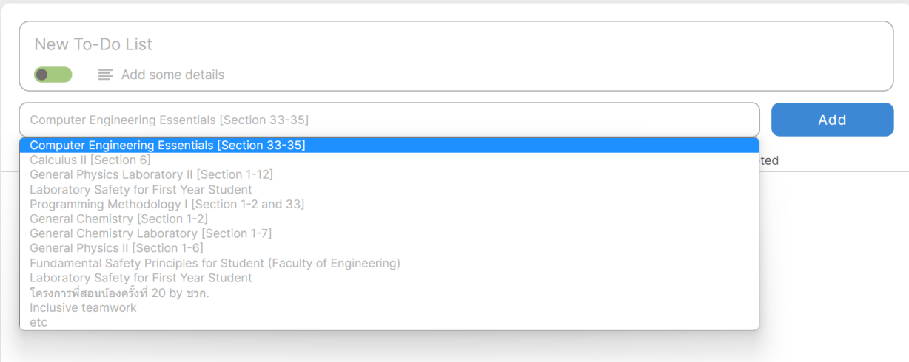
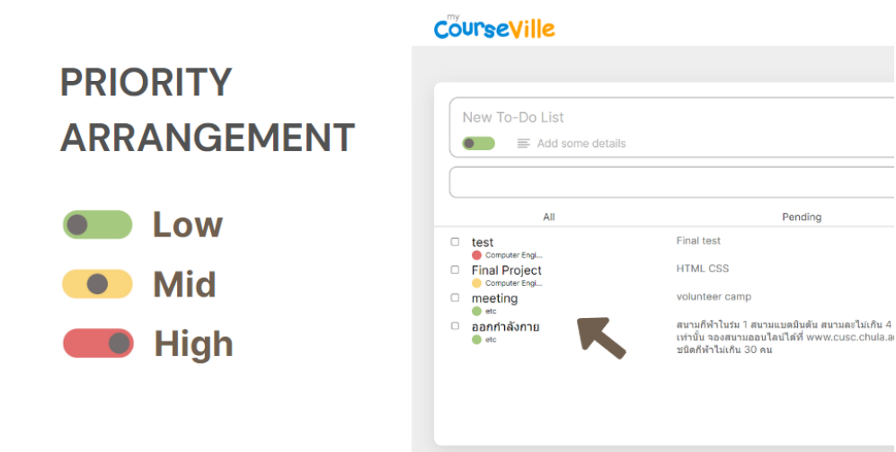
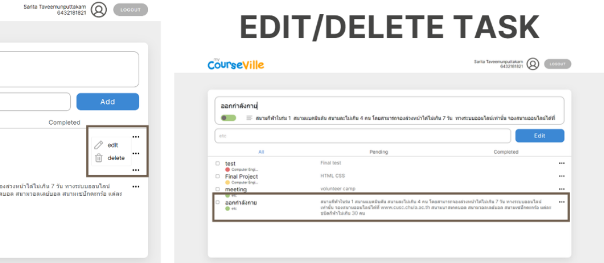
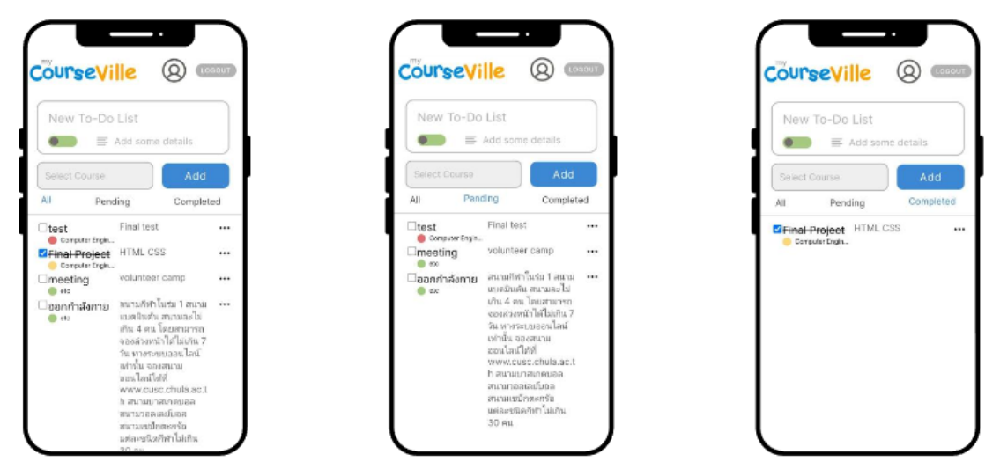

# 📝To-Do List for myCourseVille
_A web application developed by JavaScript for Computer Engineering Essentials_

> In MCV, there are deadline notifications, but there is still no tool to track or organize tasks for each subject or  subtasks.

Therefore, we have developed A To-Do List to ...
- To stay organized and keep track of tasks
- To prioritize tasks by importance and urgency
- To break down complex projects into smaller, more manageable tasks
- To help manage time effectively 

## Features
There are 4 keys feature:
- [Add Task](#add-task)
- [Arrange in order of priority](#arrange-in-order-of-priority)
- [Edit or Delete Task](#edit-or-delete-task)
- [Categorize types of tasks](#categorize-types-of-tasks)
### Add Task

To add a task you need to write your task name, details and select its course. The course
you see is all the courses you have and if it is not in selection, you can choose etc and when you
have already informed all you can click the add button and then your task will be shown below.
### Arrange in order of priority

Priority is a feature that can help you prioritize your tasks. Start from green to red. You can
choose your task priority since before you add your task and if not your task priority will be the same as
the previous task you have edited or added. Your to-do list below will show your task by showing high
priority tasks before mid and low priority will be at the bottom.

### Edit or Delete Task
All your tasks that you have added can be edited or deleted at any time you want. To
access this function you will need to click on “three dot” you see at the right of your desired
task.

If you click delete, say goodbye to your task. Your task is gone. But if you click edit all
information of that task will show at the same place as when you add your task. You can change
everything about your task and when you have already finished, click the edit button and then
your task will be updated.
### Categorize types of tasks
Your task also can be separate to 2 types. The default one is “pending”, but if you click
square at the left of your task, that task will be crossed and changed to “complete” type. You can
also use the filter to see all tasks, only pending tasks or only completed tasks as shown below.

